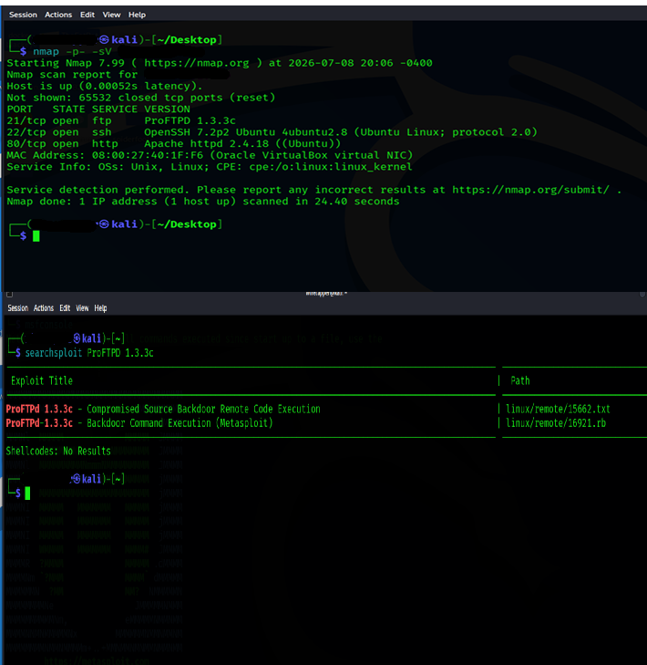
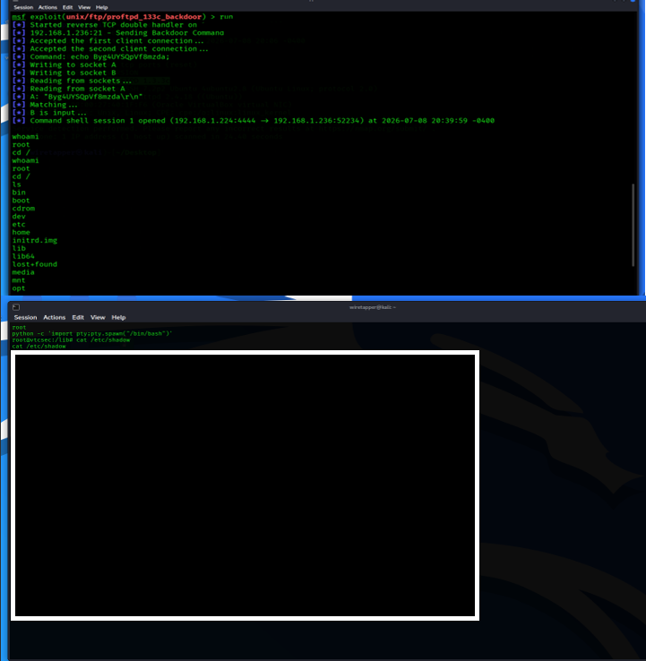

# Linux Penetration Testing Lab

## Project Overview
This project documents an end-to-end penetration testing workflow against a Linux target. The objective was to conduct network reconnaissance, identify service vulnerabilities, execute a targeted exploit, and achieve root-level access.

### 1. Network Reconnaissance & Vulnerability Scanning
The engagement began with an `nmap` scan to identify active services, followed by `searchsploit` to identify a known vulnerability in the ProFTPD service.

### 2. Exploitation & Privilege Escalation
Using the Metasploit Framework, I executed the identified exploit to establish a reverse TCP shell, gaining initial access and subsequently escalating to `root`.

### 3. Password Recovery & Analysis
After gaining system access, I retrieved the shadow file and utilized John the Ripper to perform password recovery, demonstrating the importance of strong credential management.

---

## Technical Methodology
* **Reconnaissance**: Identified ProFTPD 1.3.3c via `nmap` and confirmed vulnerability via `searchsploit`.
* **Exploitation**: Used Metasploit to successfully trigger a remote code execution backdoor.
* **Privilege Escalation**: Confirmed administrative access using `whoami`.
* **Credential Analysis**: Performed offline password cracking using John the Ripper.

## Security & Privacy Note
In accordance with professional security practices, sensitive system file outputs (such as credential hashes) have been fully sanitized and redacted from this public report to enforce data privacy and security hygiene.
